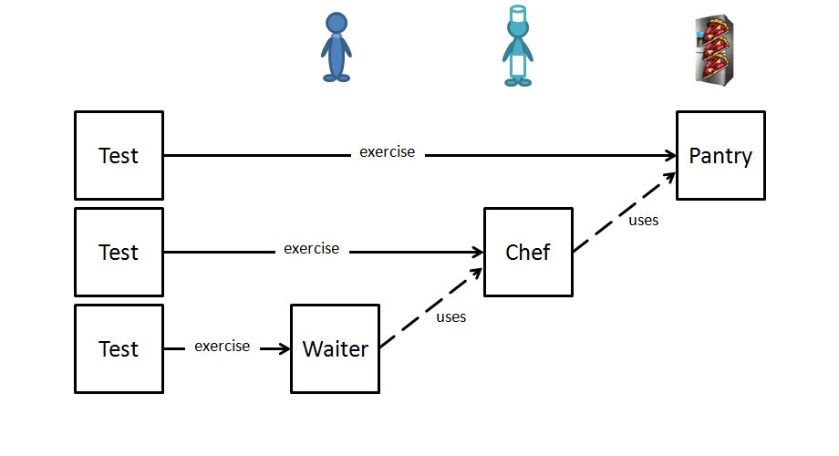
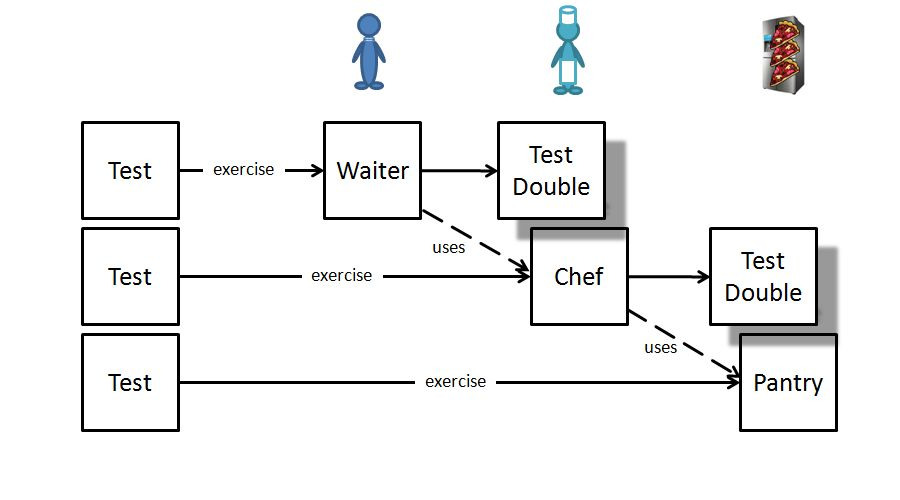

[](https://travis-ci.org/robindanzinger/chadojs)

# chadojs
chadojs is a mocking library for nodejs which reduces the need for integration tests. Instead of integration tests it supports writing verification tests.

## why a new mocking library
The problem with mocks is, that the tests still pass, although the real objects might not work together any more.

When I first started to learn tdd in javascript, I used mocks extensively. Whenever I renamed a unit or function, the unit tests didn't break (because they were unit-tests :-) ). But when I ran the application it crashed because the units didn't work together anymore. 

When you mock collaborating objects, you can't be sure, that the real object behaves like you expected.

There are two ways how you can deal with that. 
* Avoid mocks and use the real object instead
* Assure that mocks are in sync with the real object

### avoiding mocks
Avoiding mocks is not always possible or desired:
E.g. the real object is a 3rd party service, it's too slow, or might not always work (e.g. webservices, database-access). Or you want to test a specific behavior (which might depend on the time, week-day, or that a specific service is / is not available). Or in outside-in tdd the collaborating object doesn't yet exist.

### integration tests
Integration tests are often used to check, whether the real objects work together.

But integration tests are hard to setup, might be slow and we can't test specific behavior which depends on a specific state (e.g. time, service-availability, failure,...). Integration tests might fail not only because of a bug but because of a depending resource which is not available for a moment.

### verification tests
chadojs tries to address this problem with additional verification tests. With chadojs you do not need to write these types of integration tests. Instead whenever you mock a unit, you verify that the real object can behave like the mock.

## install chadojs
npm install chado --save-dev

## setup chadojs

### mocha
Create a new file (e.g.: mocha-chado.js) in your test directory and add the following lines. 
```js
var chado = require('chado');
var fs = require('fs');
after(function () {
  chado.consoleReporter.logReport();
  fs.writeFileSync(
    "chado-result.json", 
    JSON.stringify(chado.repo, null, 2)
  );
});
```
Create a new reporter file (chado-reporter.js) with following content and add it to the mocha.opts file.
```js
var Spec = require('mocha').reporters.Spec;
var setCurrentTest = require('chado').setCurrentTest;
function Reporter(runner) {
  runner.on('test', function (test) {
    setCurrentTest(test.title);
  });
  return new Spec(runner);
}
module.exports = Reporter;
```

### busterjs
Create a new file (e.g.: buster-chado.js) in your test directory and add the following lines. 
```js
var chado = require('chado');
var fs = require('fs');
var testRunner = require('buster').testRunner;
testRunner.on('suite:end', function () {
  chado.consoleReporter.logReport();
  fs.writeFileSync(
    "chado-result.json", 
    JSON.stringify(chado.repo, null, 2)
  );
});
```

### jasmine
Create a new SpecHelper file and add the following lines.
```js
var chado = require('chado');
var fs = require('fs');
var chadoJasmineReporter = {
  specStarted: function (result) {
    chado.setCurrentTest(result.fullName);
  },
  specDone : function (result) {
    chado.setCurrentTest(null);
  }
};
jasmine.getEnv().addReporter(chadoJasmineReporter);
afterAll(function() {
  chado.consoleReporter.logReport();
  fs.writeFileSync(
    "chado-result.json",
    JSON.stringify(chado.repo, null, 2)
  );
});
```

### other testrunners
Ensure that after the test suite ran chado.consoleReporter.logReport() is called and if you want to use the html-reporter that the chado.repo is written to a file. Depending on the test framework ensure also, that the testname will be set in chado.
```js
chado.setCurrentTest(testname);
```

## how does it work

chadojs uses an assume-verify-approach<br>
When you mock a function in chadojs you make an assumption about how the real object behaves.
On the other hand you have to verify that the real object can behave like you assumed.

If you forget to verify an assumption, chadojs reminds you, that there might be a problem.<br>
If you verify an assumption, but you forgot to make the assumption, chadojs reminds you, that you might not have tested all necessary use cases.

### create a mock

```js
var createDouble = require('chado').createDouble;
var myTestdouble = createDouble('collaboratorName');
var partialMock = createDouble('collaboratorName', realCollabortor);
```

### define an assumption

```js
var chado = require('chado');
var collaborator = chado.createDouble('collaboratorName');
var assume = chado.assume;
```

assume function returns a value
```js
assume(collaborator).canHandle('foo').andReturns('bar');
// collaborator.foo() === 'bar'
assume(collaborator).canHandle('foo').withArgs('argument').andReturns('bar');
// collaborator.foo('argument') === 'bar'
assume(collaborator).canHandle('foo').withArgs('first', 2, 'third').andReturns('bar');
// collaborator.foo('first', 2, 'third) === 'bar'
```

assume function throws an error
```js
assume(collaborator).canHandle('foo').andThrowsError('error message');
// collaborator.foo() -> Error: error message
assume(collaborator).canHandle('foo').withArgs('argument').andThrowsError('error message');
// collaborator.foo('argument') -> Error: error message
```

assume function calls a given callback
```js
var callback = chado.callback
// var realCallback = function (result) {console.log(result);};

assume(collaborator).canHandle('foo').withArgs(callback).andCallsCallbackWith();
// collaborator.foo(realCallback) -> console: undefined
assume(collaborator).canHandle('foo').withArgs(callback).andCallsCallbackWith('bar');
// collaborator.foo(realCallback) -> console: 'bar'
assume(collaborator).canHandle('foo').withArgs(callback, 'argument').andCallsCallbackWith('bar');
// collaborator.foo('argument', realCallback) -> Error
// collaborator.foo(realCallback, 'argument') -> console: 'bar'
assume(collaborator).canHandle('foo').withArgs('argument', callback).andCallsCallbackWith('bar');
// collaborator.foo('argument', realCallback) -> console: 'bar'
// collaborator.foo(realCallback, 'argument') -> Error
```

### define a verification

```js
var chado = require('chado');
var collaborator = chado.createDouble('collaboratorName');
var verify = chado.verify;
```

verify function returns a value
```js
var collaborator = {foo:function () { return 'bar';}};
// ok
verify('collaboratorName').canHandle('foo').andReturns('bar').on(collaborator);
verify('collaboratorName').canHandle('foo').withArgs('argument').andReturns('bar').on(collaborator);
verify('collaboratorName').canHandle('foo').withArgs('first', 2, 'third').andReturns('bar').on(collaborator);
// error
verify('collaboratorName').canHandle('foo').andReturns('foo').on(collaborator); // because bar != foo
verify('collaboratorName').canHandle('foo').withArgs('arg').andReturns('bar').on(collaborator); // because argument != arg
verify('collaboratorName').canHandle('foo').withArgs(1, 2, 'third').andReturns('bar').on(collaborator); // because 1 != first
```

verify function throws an error
```js
var collaborator = {foo: function () { throw Error('error message');}};
// ok: 
verify('collaboratorName').canHandle('foo').andThrowsError('error message').on(collaborator);
// error:
verify('collaboratorName').canHandle('bang').andThrowsError('error message').on(collaborator);
// ok
verify('collaboratorName').canHandle('foo').withArgs('argument').andThrowsError('error message').on(collaborator);
```

verify function calls a given callback
```js
var callback = chado.callback; // this function is never called in verify!
var collaborator = {foo: function (callback) {callback();};

// ok
verify('collaboratorName').canHandle('foo').withArgs(callback).andCallsCallbackWith().
  on(collaborator, function () {});    

// throws error, because collaborator.foo doesn't call callback with argument 'bar'
verify('collaboratorName').canHandle('foo').withArgs(callback).andCallsCallbackWith('bar').
  on(collaborator, function () {});    

// ok
collaborator = {foo: function (callback) {callback('bar');};
verify('collaboratorName').canHandle('foo').withArgs(callback).andCallsCallbackWith('bar').
  on(collaborator, function () {});    

// throws error, because collaborator.foo uses first argument as callback
verify('collaboratorName').canHandle('foo').withArgs('argument', callback).andCallsCallbackWith('bar').
  on(collaborator, function () {});    
  
// ok
collaborator = {foo: function (argument, callback) {callback('bar');};
verify('collaboratorName').canHandle('foo').withArgs('argument', callback).andCallsCallbackWith('bar').
  on(collaborator, function () {});    
```

### evaluate assumptions and verifications
##### manual evaluation with chado.analyzer
```js
var chado = require('chado');
// chado.repo is the repository and contains all assumptions and verifications
var repo = chado.repo;
// chado.analyzer contains functions for analyzing the assumptions and verifications
var analyzer = chado.analyzer;
// first we have to convert the repository to an array
var reportArray = analyzer.read(chado.repo);

// now we can call some functions on that array
// get all assumptions which aren't verified
var notVerifiedAssumptions = analyzer.getNotVerifiedAssumptions(reportArray);
// get all verifications which weren't assumed
var notAssumedVerifications = analyzer.getNotAssumedVerifications(reportArray);

```
##### simple console reporter
add chado.consoleReporter.logReport() after test-suite is run. Then a report is logged to the console which lists all not verified assumptions and all not assumed verifications. 
```
======================
CHADO CONSOLE REPORTER
======================

WARNING: some assumptions aren't verified
-----------------------------------------------
  collaborator.foo("any argument") => returns "bar"

-----------------------------------------------
WARNING: some verifications aren't assumed
--------------------------------------------------------------
  collaborator.foo("any argument") => returns "foobar"

--------------------------------------------------------------
```
##### html reporter
Save the assumptions repository to a file. Then you can use the chado html reporter for a more detailed report and analyze your assumptions.
```js
var fs = require('fs'); // or any other file writer library
var json = JSON.stringify(chado.repo, null, 2)
fs.writeFile("chado-result.json", json);
```

## addition

### pizza restaurant - an example
[pizza restaurant - an example](example/example.md)

### inside-out vs outside-in tdd

Because chadojs doesn't need integration test it's perfect for outside-in tdd.

In classical (or bottom-up, inside-out) tdd you write first the units which do not depend on other units. Then you write the units, which only depends on units you already have written. So you usually do not need to use mocks.



In outside-in (or top-down) tdd you write first the units next to the client or customer specification. But these units might depend on other units which do not already exist.
So you have to mock the depending units.



### simple design philosophy
If it gets too complicated, maybe you should rethink about your design.

It's one of the hardest part of programming (or anything else in the world?) to make things as simple as possible. In most cases we tend to make things complicated (at least I do). And then we extend or adapt our frameworks and libraries, which makes them complicated, too. To keep chadojs simple, it is made only for one purpose: check if two units can work together. For other purposes maybe it's not the right tool.

I don't recommend to use partial mocks. If you want to mock only a part of an object, maybe the object doesn't fulfill the single responsibility principle. Maybe you could split up your object in two. One object which you don't mock, another which you mock entirely. If that's not possible or desired, you can still use a partial mock. Just pass the real object as parameter when defining a new test double. 

chadojs doesn't support to call the real implementation inside a mock. It doesn't support clever mocks like counting the number of calls or change the behaviour depending on if it's the first or second call. It doesn't check the behaviour of a unit. If you want to test or change the behaviour you can use another mocking framework. 

However, in chadojs you should only describe how a unit uses another unit and verify whether the other unit actually works as expected.

###  references
J.B.Rainsberger: Integrated tests are a scam:<br>
http://blog.thecodewhisperer.com/blog/categories/integrated-tests-are-a-scam

I don't know any other javascript mocking framework, which supports verification tests for mocks like chadojs.
However there are some similar mocking libraries in other languages:
 * bogus for ruby: https://github.com/psyho/bogus 
 * midje for clojure: https://github.com/marick/Midje

### licence
The MIT License (MIT)

Copyright (c) <2015-2016> <copyright holders>

Permission is hereby granted, free of charge, to any person obtaining a copy
of this software and associated documentation files (the "Software"), to deal
in the Software without restriction, including without limitation the rights
to use, copy, modify, merge, publish, distribute, sublicense, and/or sell
copies of the Software, and to permit persons to whom the Software is
furnished to do so, subject to the following conditions:

The above copyright notice and this permission notice shall be included in
all copies or substantial portions of the Software.

THE SOFTWARE IS PROVIDED "AS IS", WITHOUT WARRANTY OF ANY KIND, EXPRESS OR
IMPLIED, INCLUDING BUT NOT LIMITED TO THE WARRANTIES OF MERCHANTABILITY,
FITNESS FOR A PARTICULAR PURPOSE AND NONINFRINGEMENT. IN NO EVENT SHALL THE
AUTHORS OR COPYRIGHT HOLDERS BE LIABLE FOR ANY CLAIM, DAMAGES OR OTHER
LIABILITY, WHETHER IN AN ACTION OF CONTRACT, TORT OR OTHERWISE, ARISING FROM,
OUT OF OR IN CONNECTION WITH THE SOFTWARE OR THE USE OR OTHER DEALINGS IN
THE SOFTWARE.

http://opensource.org/licenses/MIT

## faq
