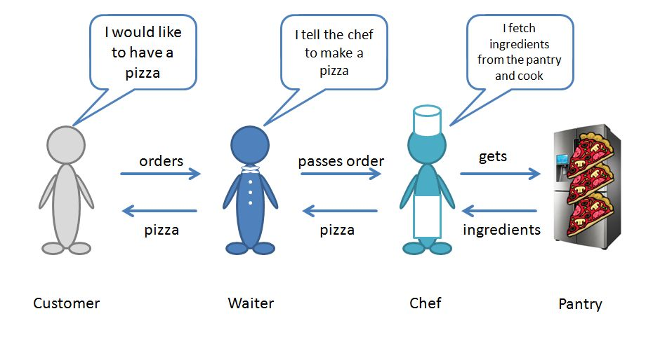

# chado example

## outside-in tdd without integration tests

chadojs supports you in outside-in tdd. 
In outside-in tdd you write your units and tests starting from the units next to the client. These outer units might depend on other units - the inner units. 
Whenever a unit (the outer unit) depends on another unit (the inner unit) you have to mock that inner unit due to it doesn't yet exist. When you mock you make an assumption about the real unit, i.e. how you think it should behave.

When you write the inner units, you have to verify your assumptions made on the mock.
You can do this with an integration test. But instead of integration tests chado uses verification tests, which are similar to unit tests. 
With chado you can guarantee without integration tests, that the outer unit does not only work with the testdouble but also with the real (inner) unit.

## pizza restaurant - an example

In our example a customer should be able to order a pizza from a waiter. The waiter then asks the chef to make the pizza. The chef gets the ingredients from the pantry and makes the pizza.



The customer is the client of our program. Waiter, Chef and Pantry shall be our units, i.e. they should work and be tested independently. We start writing code from outside-in. Our first unit will be the Waiter, then the Chef and finally the Pantry.

### 1. using chado in your test files
```js
var chado = require('chado');
var createDouble = chado.createDouble;
var assume = chado.assume; // with assume you describe your assumption
var verify = chado.verify; // with verify you can check your assumptions against a real object
```
 
### 2. specification

a customer can order a pizza from the waiter
```js
describe('pizza restaurant', function(){
  describe('a customer', function () {
    it('can successfully order a pizza tonno', function customer() {
      var waiter = createDouble('waiter');
      assume(waiter).canHandle('order').withArgs('pizza tonno').andReturns('pizza tonno'); // will never be called here
    });
  });
});
```

console output
```
======================
CHADO CONSOLE REPORTER
======================


WARNING: some assumptions aren't verified
-----------------------------------------
  waiter.order("pizza tonno") => returns "pizza tonno"

-----------------------------------------
```


### 3. verify the assumption for the waiter

We need to verify, that the waiter returns a pizza. 
But he doesn't make the pizza. He has to pass the order to the chef. 
```js
  describe('the waiter', function () {
    it('passes the translated order to the chef', function () {
      var chef = createDouble('chef');
      var waiter = createWaiter(chef);
      assume(chef).canHandle('make').withArgs('143').andReturns('pizza tonno');

      verify('waiter').canHandle('order').withArgs('pizza tonno').andReturns('pizza tonno').on(waiter);
    });
  });
```

waiter
```js
function createWaiter(chef) {
  var internalmenu = {'pizza tonno': '143'};

  function order(meal) {
    try {
      return chef.make(internalmenu[meal]);
    }
    catch (e) {
      throw new Error('Sorry. Maybe you want to order something else?');
    }
  }

  return {
    order: order
  };
}
```

console output
```
======================
CHADO CONSOLE REPORTER
======================


WARNING: some assumptions aren't verified
-----------------------------------------
  chef.make("143") => returns "pizza tonno"

-----------------------------------------
```

### 4. verify the assumption for the chef

To implement the chef we need another unit - the pantry.  It contains food and the ingredients for the pizza can be taken from it.

```js
  describe('the chef', function () {
    it('can make pizzas, if the pantry has everything needed to produce an order', function () {
      var pantry = createPantry({
        dough: ['dough'],
        cheese: ['cheese'],
        'tomato sauce': ['tomato sauce'],
        tuna: ['tuna']
      });
      var chef = createChef(pantry);

      verify('chef').canHandle('make').withArgs('143').andReturns('pizza tonno').on(chef);
    });
  });
```

chef
```js
function createChef(pantry) {
  var recipes = {'143': ['dough', 'cheese', 'tomato sauce', 'tuna']};
  var externalmenu = {'143': 'pizza tonno'};

  function make(order) {
    var ingredients = recipes[order];
    if (!pantry.has(ingredients)) {
      throw new Error('Not available');
    }
    ingredients.forEach(function (ingredient) {
      pantry.take(ingredient);
    }, this);

    return externalmenu[order];
  }

  return {
    make: make
  };
}
```


console output
```
======================
CHADO CONSOLE REPORTER
======================


```

### 5. create an empty pantry that the chef has to cope with

Everything is ok now. The customer can order a pizza, when the waiter passes the order to the chef. The chef can make a pizza, when he can take the ingredients from the pantry. 
But what happens when the pantry doesn't contain the needed ingredients? 

We might not have thought about this, when we wrote the test for the waiter. But now we implement the pantry and notice that we should test that scenario, too.
```js
  describe('the chef', function () {
    it('throws an error, when pantry is empty', function () {
      var pantry = createPantry();
      var chef = createChef(pantry);

      verify('chef').canHandle('make').withArgs('143').andThrowsError('Not available').on(chef);
    });
```

console output
```
======================
CHADO CONSOLE REPORTER
======================


WARNING: some verifications aren't assumed
------------------------------------------
  chef.make("143") => throws Error: Not available

------------------------------------------
```
All assumption are verified, but not all verifications are assumed. Maybe we have a bug! So let's test if the waiter can handle the non available order.


### 6. assume the verification chef throws an error

When the chef throws an error, the waiter should throw that error, too. 
```js
  describe('the waiter', function () {
    it('passes the translated order to the chef', function () {
      var chef = createDouble('chef');
      var waiter = createWaiter(chef);
      assume(chef).canHandle('make').withArgs('143').andReturns('pizza tonno');

      verify('waiter').canHandle('order').withArgs('pizza tonno').andReturns('pizza tonno').on(waiter);
    });

    it('throws an error, when the chef throws the error "Empty pantry"', function () {
      var chef = createDouble('chef');
      var waiter = createWaiter(chef);
      assume(chef).canHandle('make').withArgs('143').andThrowsError('Not available');

      verify('waiter').canHandle('order').withArgs('pizza tonno').andThrowsError('Sorry. Maybe you want to order something else?').on(waiter);
    });
```

console output
```
======================
CHADO CONSOLE REPORTER
======================


WARNING: some verifications aren't assumed
------------------------------------------
  waiter.order("pizza tonno") => throws Error: Sorry. Maybe you want to order something else?

------------------------------------------
```

### 7. Add the new scenario to the specification

```js
  describe('a customer', function () {
    it('can successfully order a pizza tonno', function customer() {
      var waiter = createDouble('waiter');
      assume(waiter).canHandle('order').withArgs('pizza tonno').andReturns('pizza tonno'); // will never be called here
    });

    it('will receive an "Error" if the pizza tonno is not available', function customer() {
      var waiter = createDouble('waiter');
      assume(waiter).canHandle('order').withArgs('pizza tonno').andThrowsError('Sorry. Maybe you want to order something else?'); // will never be called here
    });
  });
```

console output
```
======================
CHADO CONSOLE REPORTER
======================
```

### 8. What next?
Now our pizza restaurant is fully tested. The waiter can talk to the chef. And the chef works with the pantry. Even error handling is implemented although we didn't think of it when we made the specification.
What next? Another specification? How does the pantry get filled? Or are there any other issues, which we discovered when we wrote the program? Go on with your imagination and what you think we still miss.

### references
[example code](example.js)

